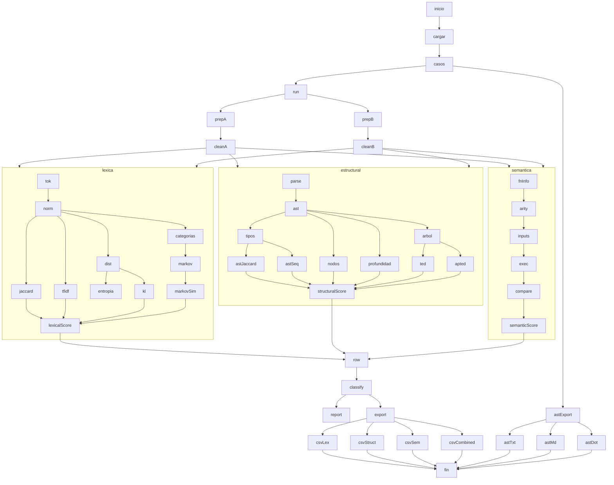

# Prototipo de deteccion de similitud en codigo Python

Este proyecto implementa una primera version academica de un detector de similitud/plagio en codigo fuente Python.

La arquitectura general propuesta es por capas:

```text
Codigo A y Codigo B
    -> Capa 0: Preprocesamiento y prefiltro de strings
    -> Capa 1: Lexica-estadistica
    -> Capa 2: Estructural
    -> Capa 3: Semantica
    -> Fusion de puntajes
    -> Probabilidad de plagio
```

En esta etapa estan implementadas una Capa 0 de preprocesamiento y prefiltro de strings para detectar clones Type-1 casi exactos, una Capa 1 lexico-estadistica, una Capa 2 estructural basada en AST y una primera Capa 3 experimental. La Capa 3 puede arrancar con embeddings de codigo y similitud coseno como aproximacion semantica inicial, mientras que en una evolucion posterior puede incorporar ejecucion controlada de funciones. La Capa 2 ya incluye una version simple de Tree Edit Distance ordenada y soporte para APTED mediante dependencia externa. No se implementan todavia modelos semanticos pesados, redes neuronales ni clasificador final.

## Archivos principales

### `lexical_statistical_layer.py`

Contiene el motor del analizador. Es el archivo donde viven las funciones reutilizables:

- limpieza basica del codigo,
- tokenizacion,
- normalizacion de tokens,
- calculo de metricas lexicas y estadisticas,
- comparacion de patrones de transicion,
- fusion inicial del score de Capa 1.

### `string_prefilter.py`

Contiene la Capa 0 de preprocesamiento y prefiltro de strings. Su objetivo es limpiar el codigo y descartar muy rapido copias casi exactas antes de pasar a las capas mas costosas.

Esta capa:

- preprocesa el codigo eliminando comentarios, docstrings y whitespaces innecesarios,
- normaliza el texto resultante para comparacion,
- compara igualdad exacta tras normalizacion,
- calcula un ratio de similitud basado en `SequenceMatcher`,
- marca pares como duplicados cercanos cuando superan un umbral.

### `embeddings.py`

Contiene una primera version de la Capa 3 basada en embeddings ligeros de TF-IDF.

Esta capa:

- transforma el codigo limpio en una secuencia de tokens normalizados,
- vectoriza ese texto con `TfidfVectorizer`,
- compara ambos fragmentos con similitud coseno,
- devuelve un `embedding_score` reutilizable como aproximacion semantica inicial.

### `test.py`

Es el campo de pruebas del proyecto. No contiene la logica principal del analizador; importa las funciones de `lexical_statistical_layer.py` y ejecuta varios casos comparativos.

Al correrlo, imprime resultados en consola y exporta archivos CSV con las metricas:

```text
results/lexical_statistical_results.csv
results/structural_results.csv
results/semantic_results.csv
results/combined_layer_results.csv
results/ast_visualizations/
```

### `structural_layer.py`

Contiene la primera version de la Capa 2 estructural. Usa el modulo estandar `ast` de Python para construir arboles sintacticos abstractos y comparar su forma general.

Esta capa calcula:

- secuencias de tipos de nodos AST,
- distribuciones de nodos AST,
- similitud Jaccard de tipos de nodos,
- similitud de recorrido preorden,
- similitud de cantidad de nodos,
- similitud de profundidad,
- Tree Edit Distance,
- similitud normalizada basada en Tree Edit Distance,
- APTED Tree Edit Distance,
- similitud normalizada basada en APTED,
- `structural_score`.

### `ast_visualizer.py`

Genera visualizaciones del AST para inspeccion manual.

Puede exportar:

- arbol indentado en `.txt`,
- diagrama Mermaid en `.md`,
- grafo Graphviz DOT en `.dot`.

Por defecto oculta nombres concretos de identificadores y literales para enfocarse en la estructura.

### `semantic_layer.py`

Contiene una version experimental de analisis semantico por comportamiento.

Esta capa:

- detecta la primera funcion definida en cada fragmento,
- elige una aridad comparable,
- genera inputs controlados,
- ejecuta ambas funciones en subprocess con timeout,
- compara salidas y excepciones,
- calcula `semantic_score`.

Esta version convive con la capa de embeddings, que sirve como primer aproximador semantico barato antes de ejecutar codigo. La version de comportamiento no usa modelos pesados ni ejecuta el codigo dentro del proceso principal.

### `results/`

Carpeta para guardar salidas de pruebas y resultados exportados.

## Como ejecutar

Desde la carpeta del proyecto:

```bash
python3 -m venv .env
source .env/bin/activate
python -m pip install -r requirements.txt
python test.py
```

Esto ejecuta todos los casos definidos en `TEST_CASES`, imprime un reporte compacto y genera los CSV.

Para verificar sintaxis:

```bash
python -m py_compile lexical_statistical_layer.py structural_layer.py semantic_layer.py ast_visualizer.py test.py
```

Si no se instala `apted`, el proyecto sigue corriendo con la distancia estructural interna como fallback, pero las columnas APTED indicaran que no esta disponible.

## Flujo del analizador

El flujo actual es:

```text
Codigo A y Codigo B
    -> Capa 0: preprocess_code -> similarity_ratio -> descarte temprano de clones Type-1
        -> Capa 1: tokenize_code -> normalize_tokens -> metricas lexicas/estadisticas -> lexical_statistical_score
        -> Capa 2: parse_python_ast -> metricas estructurales AST -> structural_score
        -> Capa 3: embeddings TF-IDF -> similitud coseno -> embedding_score
        -> Capa 3 experimental: ejecucion controlada de funciones -> semantic_score
```

Diagrama detallado del flujo de ejecucion:



La separacion es importante:

- `preprocess_code` solo limpia codigo.
- En el flujo integrado de `test.py`, `run_layers_once` ejecuta el preprocesamiento una sola vez por par de codigos y entrega ese codigo limpio a las capas.
- `normalize_tokens` pertenece a la Capa 1 porque afecta directamente las metricas de similitud.
- `parse_python_ast` pertenece a la Capa 2 porque ya analiza estructura sintactica, no solo tokens.
- `analyze_semantic_similarity` pertenece a la Capa 3 porque compara comportamiento observable con inputs de prueba.

## Documentacion de funciones

### `preprocess_code(code: str) -> str`

Elimina comentarios, intenta eliminar docstrings y limpia espacios innecesarios.

No cambia nombres de variables ni literales. Su objetivo es quitar ruido textual antes de analizar tokens.

### `tokenize_code(code: str) -> list[str]`

Usa el modulo estandar `tokenize` de Python para convertir el codigo en tokens.

Ignora:

- saltos de linea,
- indentacion,
- dedentacion,
- comentarios,
- encoding,
- marcador de fin.

Esto cumple el papel de analisis lexico basico, pero no construye un parser propio.

### `normalize_tokens(tokens: list[str]) -> list[str]`

Normaliza elementos que suelen cambiar en plagio superficial:

- identificadores de usuario -> `ID`,
- numeros y strings -> `LITERAL`.

Conserva palabras clave y operadores relevantes como:

- `if`,
- `for`,
- `while`,
- `def`,
- `return`,
- `+`,
- `=`,
- `==`,
- `>=`.

Ejemplo:

```python
def suma(lista):
    total = 0
    return total
```

puede convertirse en:

```text
def ID ( ID ) : ID = LITERAL return ID
```

### `jaccard_similarity(tokens_a, tokens_b) -> float`

Calcula el solapamiento entre conjuntos de tokens unicos:

```text
interseccion / union
```

Sirve para medir que tantos tokens normalizados comparten ambos codigos.

### `tfidf_cosine_similarity(tokens_a, tokens_b) -> float`

Construye una representacion TF-IDF ligera y calcula similitud coseno.

Complementa Jaccard porque toma en cuenta frecuencia de tokens, no solo presencia o ausencia.

### `token_distribution(tokens) -> dict[str, float]`

Convierte la lista de tokens en una distribucion de probabilidad.

Ejemplo:

```text
ID: 0.50
return: 0.25
LITERAL: 0.25
```

### `shannon_entropy(distribution) -> float`

Mide la diversidad de la distribucion de tokens.

- Entropia baja: pocos tokens dominan.
- Entropia alta: mayor variedad de tokens.

No decide plagio por si sola, pero describe el perfil lexico del codigo.

### `kl_divergence(dist_p, dist_q, epsilon=1e-10) -> float`

Calcula la divergencia KL entre dos distribuciones:

```text
D_KL(P || Q)
```

Mide que tan diferente es la distribucion de tokens de un codigo respecto al otro.

Se usa `epsilon` para evitar problemas matematicos con `log(0)`.

Como KL no es simetrica, se calculan dos direcciones:

- A -> B,
- B -> A.

Despues se usa una version simetrica promedio para convertirla en similitud:

```python
symmetric_kl = (kl_a_to_b + kl_b_to_a) / 2
kl_similarity = 1 / (1 + symmetric_kl)
```

### `categorize_tokens(tokens) -> list[str]`

Agrupa tokens en categorias generales:

- `CTRL`: control de flujo, como `if`, `for`, `while`.
- `FUNC`: funciones o retornos, como `def`, `return`, `print`.
- `OP`: operadores aritmeticos o asignacion.
- `LOGIC`: operadores logicos o comparaciones.
- `LITERAL`: numeros o strings normalizados.
- `ID`: identificadores normalizados.
- `OTHER`: cualquier otro token.

Esto permite comparar patrones mas abstractos que los tokens exactos.

### `markov_transition_matrix(states) -> dict[str, dict[str, float]]`

Construye una matriz de transicion entre categorias de tokens.

Ejemplo conceptual:

```text
FUNC -> ID
ID -> OTHER
CTRL -> ID
```

La matriz representa probabilidades de pasar de una categoria a otra.

### `compare_markov_matrices(matrix_a, matrix_b) -> float`

Compara dos matrices de transicion usando distancia absoluta promedio.

Devuelve una similitud entre 0 y 1:

- 1 significa patrones de transicion muy parecidos.
- 0 significa patrones muy diferentes.

### `analyze_lexical_statistical_similarity(code_a, code_b) -> dict`

Ejecuta todo el flujo:

1. Preprocesa ambos codigos.
2. Tokeniza.
3. Normaliza.
4. Calcula Jaccard.
5. Calcula coseno TF-IDF.
6. Calcula distribuciones.
7. Calcula entropias.
8. Calcula KL en ambas direcciones.
9. Calcula similitud Markov.
10. Fusiona el score de Capa 1.

Devuelve un diccionario con:

- `tokens_a`,
- `tokens_b`,
- `normalized_tokens_a`,
- `normalized_tokens_b`,
- `jaccard_similarity`,
- `tfidf_cosine_similarity`,
- `entropy_a`,
- `entropy_b`,
- `kl_divergence_a_to_b`,
- `kl_divergence_b_to_a`,
- `markov_similarity`,
- `lexical_statistical_score`.

## Documentacion de la Capa 2 estructural

### `parse_python_ast(code: str) -> ast.AST`

Preprocesa el codigo y lo convierte en un AST usando `ast.parse`.

Si recibe codigo vacio, devuelve un modulo AST vacio. Si el codigo tiene errores de sintaxis, lanza un `ValueError`.

### `ast_node_type_sequence(tree: ast.AST) -> list[str]`

Recorre el AST y devuelve una secuencia de nombres de tipos de nodos.

Ejemplo conceptual:

```text
Module -> FunctionDef -> arguments -> arg -> Assign -> Name -> Constant -> Return
```

Se ignoran algunos nodos de contexto como `Load`, `Store` y `Del`, porque suelen agregar ruido tecnico mas que estructura programatica relevante.

### `ast_node_distribution(node_types: list[str]) -> dict[str, float]`

Convierte los tipos de nodos AST en una distribucion de probabilidad.

Esto permite saber que porcentaje del arbol corresponde a nodos como `FunctionDef`, `For`, `If`, `Return`, `BinOp`, etc.

### `ast_jaccard_similarity(nodes_a, nodes_b) -> float`

Calcula Jaccard sobre los tipos de nodos AST unicos.

Mide si ambos codigos usan clases similares de estructuras sintacticas.

### `ast_sequence_similarity(nodes_a, nodes_b) -> float`

Compara las secuencias de nodos AST usando `SequenceMatcher`.

Esta metrica captura parcialmente el orden del recorrido del arbol.

### `ast_depth(tree: ast.AST) -> int`

Calcula la profundidad maxima del AST.

Un codigo con estructuras anidadas suele tener mayor profundidad.

### `numeric_similarity(value_a, value_b) -> float`

Convierte la diferencia entre dos valores numericos no negativos en una similitud entre 0 y 1.

Se usa para comparar:

- cantidad de nodos AST,
- profundidad del AST.

### `ast_to_comparable_tree(tree: ast.AST) -> ComparableASTNode`

Convierte el AST de Python en un arbol compacto e inmutable para comparacion estructural.

Cada nodo conserva principalmente:

- etiqueta del tipo de nodo,
- hijos ordenados.

Esto evita comparar directamente objetos internos de Python y permite aplicar distancia de edicion sobre una estructura mas simple.

### `tree_edit_distance(tree_a, tree_b) -> int`

Calcula una distancia de edicion ordenada entre dos arboles AST compactos.

Las operaciones consideradas son:

- insertar subarbol,
- eliminar subarbol,
- cambiar la etiqueta de un nodo.

Insertar o eliminar un subarbol cuesta segun su tamano. Cambiar una etiqueta cuesta 1 si los tipos de nodo son distintos.

Esta version es una implementacion sencilla con programacion dinamica. No es APTED, pero permite medir de forma mas fuerte cuantas transformaciones estructurales separan dos AST.

### `tree_edit_similarity(tree_a, tree_b) -> float`

Convierte la distancia de edicion en una similitud entre 0 y 1:

```text
1.0 -> arboles muy parecidos o identicos
0.0 -> arboles muy diferentes segun la distancia normalizada
```

La normalizacion usa el tamano del arbol mas grande para que el resultado sea comparable entre ejemplos.

### `apted_tree_edit_distance(tree_a, tree_b) -> int | None`

Calcula Tree Edit Distance usando la libreria externa `apted` cuando esta instalada.

APTED es un algoritmo especializado para distancia de edicion entre arboles. En este proyecto se aplica sobre el arbol AST compacto generado por `ast_to_comparable_tree`.

Si la dependencia no esta disponible, devuelve `None` y el analisis estructural sigue funcionando con la distancia interna.

### `apted_tree_edit_similarity(tree_a, tree_b) -> float | None`

Convierte la distancia APTED en una similitud normalizada entre 0 y 1.

Cuando APTED esta disponible, esta similitud se usa como componente principal del `structural_score`. Cuando no esta disponible, se usa como fallback la similitud estructural interna.

### `analyze_structural_similarity(code_a, code_b) -> dict`

Ejecuta toda la Capa 2:

1. Preprocesa y parsea ambos codigos.
2. Extrae secuencias de nodos AST.
3. Calcula distribuciones de nodos.
4. Calcula Jaccard de tipos de nodos.
5. Calcula similitud de secuencia AST.
6. Calcula similitud de cantidad de nodos.
7. Calcula similitud de profundidad.
8. Calcula Tree Edit Distance.
9. Calcula similitud normalizada de Tree Edit Distance.
10. Calcula APTED Tree Edit Distance si la dependencia esta instalada.
11. Calcula similitud normalizada basada en APTED.
12. Fusiona el `structural_score`.

La fusion inicial es:

```python
structural_score =
    0.30 * apted_tree_edit_similarity
  + 0.25 * ast_sequence_similarity
  + 0.20 * ast_node_type_jaccard
  + 0.15 * ast_node_count_similarity
  + 0.10 * ast_depth_similarity
```

Si APTED no esta instalado, el primer termino usa `tree_edit_similarity` como fallback.

Este score representa parecido estructural, no similitud semantica.

## Visualizacion del AST

El archivo `ast_visualizer.py` permite convertir codigo Python en representaciones visuales del AST.

Uso directo:

```bash
source .env/bin/activate
python ast_visualizer.py
```

Esto genera archivos en:

```text
results/ast_visualizations/
```

Formatos generados:

- `.txt`: arbol indentado facil de leer en consola.
- `.md`: diagrama Mermaid para ver en visores Markdown compatibles.
- `.dot`: archivo Graphviz para renderizar como imagen si se tiene Graphviz instalado.

Tambien se puede usar desde codigo:

```python
from ast_visualizer import export_ast_visualizations

export_ast_visualizations(code, "example")
```

Por defecto, la visualizacion muestra tipos de nodos como `FunctionDef`, `For`, `If`, `Return`, `BinOp` o `Compare`, pero no muestra nombres concretos de variables ni literales. Esto ayuda a inspeccionar la estructura sin depender de renombramientos superficiales.

## Analisis semantico por ejecucion

El archivo `semantic_layer.py` compara el comportamiento observable de dos funciones.

El flujo es:

```text
codigo A y codigo B
    -> detectar primera funcion
    -> elegir aridad comparable
    -> generar inputs controlados
    -> ejecutar cada funcion en subprocess
    -> comparar outputs
    -> semantic_score
```

Funciones principales:

### `extract_first_function_info(code: str) -> FunctionInfo | None`

Extrae nombre y numero de argumentos de la primera funcion definida en el codigo.

### `choose_comparable_arity(function_a, function_b) -> int | None`

Elige una cantidad de argumentos que ambas funciones puedan recibir.

### `generate_test_inputs(arity: int) -> list[tuple[Any, ...]]`

Genera inputs deterministas para probar funciones pequenas.

### `execute_function_once(code, function_name, args, timeout_seconds) -> dict`

Ejecuta una llamada en un subprocess con timeout. El resultado puede ser:

- retorno normal,
- excepcion,
- timeout,
- error del runner.

### `compare_execution_results(executions) -> dict`

Resume los resultados:

- cantidad de casos,
- casos donde ambas funciones retornaron,
- retornos iguales,
- excepciones iguales,
- similitud de outputs,
- cobertura de ejecucion exitosa.

### `analyze_semantic_similarity(code_a, code_b) -> dict`

Ejecuta todo el analisis semantico por comportamiento y devuelve `semantic_score`.

Esta capa es util para detectar casos donde la estructura cambia, pero el comportamiento se conserva, por ejemplo un ciclo `for` contra una list comprehension.

Limitacion importante: ejecutar codigo de terceros siempre tiene riesgos. Esta version usa subprocess, timeout y builtins limitados, pero no debe considerarse un sandbox de seguridad fuerte.

## Metricas calculadas

### Similitud Jaccard

Mide solapamiento de tokens normalizados unicos.

### Similitud coseno TF-IDF

Mide parecido entre frecuencias ponderadas de tokens.

### Distribucion de tokens

Representa cada codigo como una distribucion de probabilidad sobre tokens.

### Entropia de Shannon

Mide diversidad o incertidumbre en los tokens de cada codigo.

### Divergencia KL A -> B

Mide la diferencia de la distribucion del Codigo A respecto al Codigo B.

### Divergencia KL B -> A

Mide la diferencia de la distribucion del Codigo B respecto al Codigo A.

### Similitud Markov

Mide parecido entre patrones de transicion de categorias de tokens.

### Similitud KL

Convierte la divergencia KL simetrica en una similitud entre 0 y 1:

```python
kl_similarity = 1 / (1 + symmetric_kl)
```

### Score lexico-estadistico final

Fusion inicial:

```python
lexical_statistical_score =
    0.30 * jaccard_similarity
  + 0.30 * tfidf_cosine_similarity
  + 0.20 * markov_similarity
  + 0.20 * kl_similarity
```

Este score no es una probabilidad final de plagio. Es solo el resultado de la Capa 1.

## Metricas estructurales calculadas

### AST node type Jaccard

Mide el solapamiento entre tipos de nodos AST unicos.

### AST sequence similarity

Mide que tan parecido es el recorrido preorden de los dos AST.

### AST node count similarity

Compara el tamano de ambos arboles segun su cantidad de nodos.

### AST depth similarity

Compara la profundidad maxima de ambos arboles.

### Tree Edit Distance

Mide cuantas operaciones estructurales se necesitan para transformar un AST compacto en otro.

### Tree Edit similarity

Convierte la distancia de edicion en una similitud normalizada entre 0 y 1.

### APTED Tree Edit Distance

Mide distancia de edicion entre arboles usando el algoritmo APTED cuando la dependencia esta instalada.

### APTED Tree Edit similarity

Convierte la distancia APTED en una similitud normalizada entre 0 y 1.

### Structural score

Fusiona las metricas estructurales en un valor entre 0 y 1.

## Umbrales provisionales

Los umbrales actuales son interpretativos y deben validarse con mas casos:

```text
score >= 0.80  -> similitud alta
0.50 - 0.79    -> similitud media
score < 0.50   -> similitud baja
```

Estos umbrales estan implementados en `test.py` mediante `classify_similarity`.

## CSV de resultados

`test.py` exporta:

```text
results/lexical_statistical_results.csv
results/structural_results.csv
results/semantic_results.csv
results/combined_layer_results.csv
```

Columnas principales del CSV lexico:

- `caso`,
- `similitud_esperada_lexica`,
- `similitud_observada_lexica`,
- `coincide_lexica`,
- `jaccard_similarity`,
- `tfidf_cosine_similarity`,
- `markov_similarity`,
- `kl_divergence_a_to_b`,
- `kl_divergence_b_to_a`,
- `lexical_statistical_score`,
- `nota`.

Columnas principales del CSV estructural:

- `caso`,
- `similitud_esperada_estructural`,
- `similitud_observada_estructural`,
- `coincide_estructural`,
- `ast_node_type_jaccard`,
- `ast_sequence_similarity`,
- `ast_node_count_similarity`,
- `ast_depth_similarity`,
- `tree_edit_distance`,
- `tree_edit_similarity`,
- `apted_available`,
- `apted_tree_edit_distance`,
- `apted_tree_edit_similarity`,
- `structural_score`,
- `nota`.

Columnas principales del CSV semantico:

- `caso`,
- `similitud_esperada_semantica`,
- `similitud_observada_semantica`,
- `coincide_semantica`,
- `semantic_runnable`,
- `semantic_reason`,
- `semantic_function_a`,
- `semantic_function_b`,
- `semantic_tested_arity`,
- `semantic_total_cases`,
- `semantic_both_return_count`,
- `semantic_matching_return_count`,
- `semantic_successful_overlap`,
- `semantic_output_similarity`,
- `semantic_score`,
- `nota`.

El CSV combinado reune las tres capas en una sola tabla. Estos archivos sirven para que otra persona pueda corroborar los resultados y discutir si las metricas, pesos o umbrales deben ajustarse.

## Limitaciones actuales

1. La Capa 2 estructural sigue siendo perfectible.

Ya existe comparacion AST, una version simple de Tree Edit Distance y soporte para APTED. Aun asi, el metodo sigue siendo perfectible porque no compara significado ni equivalencia algoritmica profunda.

2. El analisis semantico actual es experimental.

Ya existe una primera comparacion por ejecucion controlada de funciones, pero no equivale a entender significado, intencion ni equivalencia algoritmica profunda. Depende de los inputs generados y debe revisarse junto con `semantic_successful_overlap`.

3. La normalizacion puede ocultar diferencias relevantes.

Al convertir identificadores a `ID` y literales a `LITERAL`, el sistema resiste cambios superficiales, pero tambien puede perder informacion importante.

4. El orden solo se captura parcialmente.

La similitud Markov toma en cuenta transiciones locales entre categorias, y la Capa 2 toma un recorrido AST. Aun asi, no se modelan dependencias largas ni reordenamientos complejos de forma robusta.

5. Los umbrales son provisionales.

Los rangos alta/media/baja sirven para exploracion inicial, no como criterio definitivo.

6. El score final es una fusion manual.

Los pesos actuales son razonables para un baseline:

```text
30% Jaccard
30% TF-IDF
20% Markov
20% KL
```

Pero deben ajustarse con datos y validacion.

7. Puede haber falsos positivos.

Codigos muy simples o con patrones comunes pueden obtener similitud alta aunque no exista plagio.

8. Puede haber falsos negativos.

Codigos semanticamente equivalentes, pero escritos con estructuras muy diferentes, pueden recibir similitud media o baja.

## Siguiente paso recomendado

Despues de validar las metricas actuales con los CSV, el siguiente paso natural es crear una fusion inicial entre puntajes:

```text
lexical_statistical_score + structural_score + semantic_score -> combined_score
```

Esa fusion todavia puede ser ponderada y transparente, sin clasificador entrenado.

Despues, la arquitectura podria fusionar puntajes:

```python
final_score = (
    0.40 * lexical_statistical_score
    + 0.35 * structural_score
    + 0.25 * semantic_score
)
```

Mas adelante, si existe un conjunto etiquetado, esos scores pueden alimentar un clasificador supervisado.

## Frase para defender el prototipo

Este prototipo implementa capas explicables y ligeras para comparar codigo Python. La Capa 1 limpia, tokeniza y normaliza codigo para calcular metricas lexicas y estadisticas. La Capa 2 parsea el codigo con AST y compara rasgos estructurales como tipos de nodos, recorrido, tamano y profundidad. La Capa 3 actual compara comportamiento observable mediante ejecucion controlada de funciones. No pretende resolver por completo el plagio; funciona como base defendible para extender despues hacia embeddings, fusion de puntajes y validacion con datos etiquetados.
